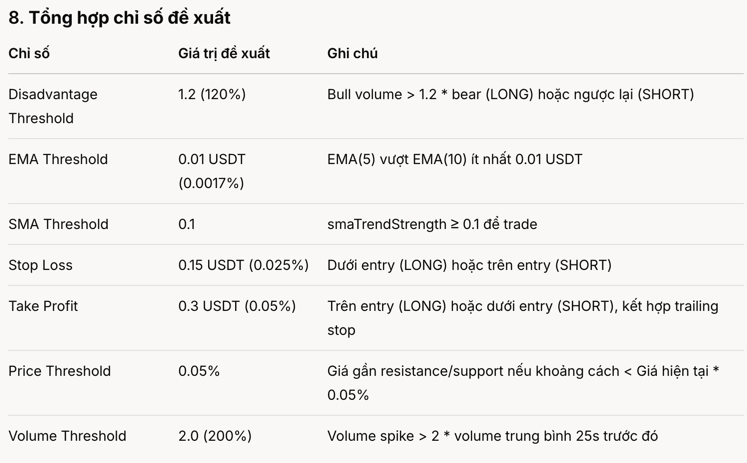

Tổng hợp chỉ số đề xuất
Chỉ số	Giá trị đề xuất	Ghi chú
Disadvantage Threshold	1.2 (120%)	Bull volume > 1.2 * bear (LONG) hoặc ngược lại (SHORT)
EMA Threshold	0.01 USDT (0.0017%)	EMA(5) vượt EMA(10) ít nhất 0.01 USDT
SMA Threshold	0.1	smaTrendStrength ≥ 0.1 để trade
Stop Loss	0.15 USDT (0.025%)	Dưới entry (LONG) hoặc trên entry (SHORT)
Take Profit	0.3 USDT (0.05%)	Trên entry (LONG) hoặc dưới entry (SHORT), kết hợp trailing stop
Price Threshold	0.05%	Giá gần resistance/support nếu khoảng cách < Giá hiện tại * 0.05%
Volume Threshold	2.0 (200%)	Volume spike > 2 * volume trung bình 25s trước đó

